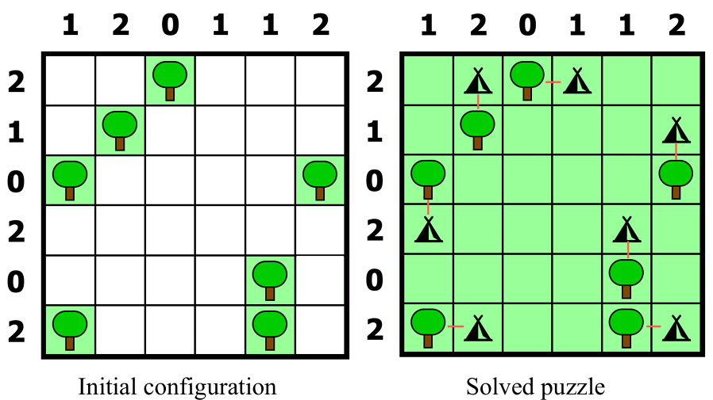

<!--
SPDX-FileCopyrightText: 2024 Eliseo Pita Vilariño and Antón Gómez López

SPDX-License-Identifier: MIT
-->

# Tent and Trees

This academic project is part of the first assignment of the subject _Reasoning and Planning_ of the Master's Degree in Artificial Intelligence at the University of Santiago de Compostela.

This assignment consists in solving the tents and trees puzzle (you can try [here](https://www.puzzle-tents.com/) the online game) described as follows. We have a grid of $n \times n$ cells. Some cells contain trees that constitute a fixed input, and the rest have to be filled with a tent or left empty. Besides, each row and each column are assigned a number (of tents to be placed). The rules for placing tents are as follows:

1. Each tree must have a uniquely associated tent that must be next
   to the tree, either horizontally or vertically (diagonal doesn't
   count).
2. Tents cannot touch each other, even diagonally.
3. The number of tents placed in each row (respectively, column) must coincide with the assigned input number for that row (respectively, column).

The following images show an example of initial configuration of a puzzle ($6 \times 6$) and the final solution where, additionally, we have also represented which tent is associated to each tree, using a small red line.

<div align="center">
  
</div>

The objective is build a ASP program that, given an input puzzle, finds a solution that satisfies the rules described above. Additionally, we have to implement two Python scripts that allow us read the input puzzle and print the solution in a human-readable format, respectively.

## Files

- `tents.lp`: ASP program that solves the puzzle.
- `encode.py`: Python script that reads the input puzzle and generates the input as a ASP program.
- `decode.py`: Python script that reads the output of the ASP program and prints the solution in a human-readable format.
- `drawtents.lp`: Defines the logic of the "Tents & Trees" problem and its graphical visualization using ASP rules with the `&display` theory.
- `display.py`: Graphically renders the results generated by the `.lp` file using Pygame to interpret the literals of the `&display` theory.
- `examples/`: Contains some examples of input puzzles.
- `solutions/`: Contains the solutions of the examples in the `examples/` folder.
- `output/`: Contains the output of the ASP program for the examples in the `examples/` folder decoded by the `decode.py` script.
- `pics/`: Contains some images used by the `display.py` script and this README.

## Requirements

To run the ASP program, you need to install [clingo](https://potassco.org/clingo/). The only Python dependency is [pygame](https://www.pygame.org/), which can be installed with the following command:

```bash
pip install pygame
```

## Usage

The encoding of the input puzzle is done by the `encode.py` script. The input is a text file with a similar format to the following example:

```
..t...
.t....
t....t
......
....t.
t...t.
1 2 0 1 1 2
2 1 0 2 0 2
```

The dots represent empty cells, the `t` represent trees, and the numbers at the end of the file represent the number of tents to be placed in each column and row, respectively. The script can be executed as follows to encode all the examples in the `examples/` folder:

```bash
python encode.py dom0[0-8].txt
```

This will generate a file with the same name as the input file but with the extension `.lp`. This file can be used as input for the ASP program. The ASP program can be executed as follows:

```bash
clingo 0 tents.lp examples/dom01.lp
```

The program should generate only one model that represents the solution of the puzzle. The output of the program can be passed to the `decode.py` script to generate a human-readable representation of the solution:

```bash
python decode.py tents.lp examples/dom01.lp
```

To compare the solution with the original puzzle, you can use the `diff` command:

```bash
python decode.py tents.lp examples/dom01.lp | diff -sy solutions/sol01.txt -
```

Finally, the `display.py` script can be used to graphically represent the solution. The script can be executed as follows:

```bash
python display.py tents.lp domain.lp drawtents.lp
```

This will open a window with the graphical representation of the solution.

## Contributors

- [Eliseo Pita Vilariño](https://github.com/elipitav)
- [Antón Gómez López](https://github.com/antongomez)

## License

This project is licensed under the MIT License - see the [LICENSE](LICENSE) file for details.
